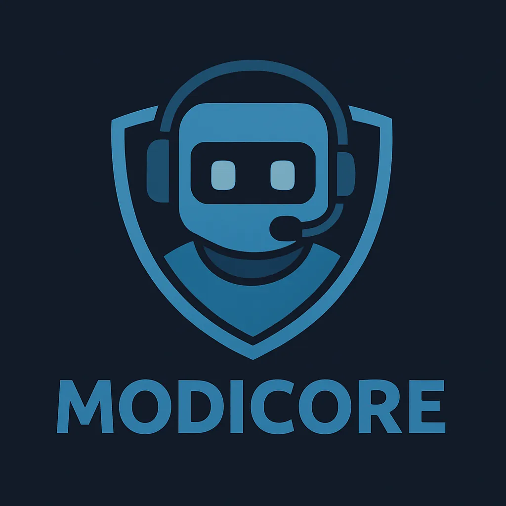

# 🌐 ModiCore Bot Website

This is the official landing page for **ModiCore**, a Discord bot.  
It includes an invite button, Terms of Service, and Privacy Policy.

---

## 📂 Project Structure
.
├── index.html # Landing page with Invite, ToS, and Privacy buttons
├── tos.html # Terms of Service page
├── privacy.html # Privacy Policy page
├── ModiCore.png # Bot avatar (used in the website)
└── README.md # Project documentation

yaml
Sao chép
Chỉnh sửa

---

## 🚀 Features
- ✅ Modern landing page with bot avatar  
- ✅ Invite button (direct to Discord OAuth2 link)  
- ✅ Separate Terms of Service and Privacy Policy pages  
- ✅ Responsive design, works on PC and mobile  

---

## 🔗 Important Links
- **Invite Bot:** [Click here to invite ModiCore](https://discord.com/oauth2/authorize?client_id=1398776861202583752&permissions=1116959932470&integration_type=0&scope=bot+applications.commands)  
- **Terms of Service:** [tos.html](./tos.html)  
- **Privacy Policy:** [privacy.html](./privacy.html)  

---

## ⚡ How to Use
1. Clone or download this repository.  
2. Open `index.html` in your browser.  
3. Host it on GitHub Pages, Vercel, or Netlify if you want it online.  

---

## 📸 Preview

---

## 📜 License
This project is free to use for **ModiCore** bot purposes only.  
You may modify it to suit your server/community needs.  
